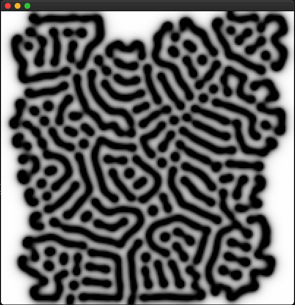

# Reaction Diffusion

This System was build on top of [openFrameworks](https://openframeworks.cc/)
which is an awesome C++ Library to get started with graphics programming.

---
I used it to implement a [reaction-diffusion
system](https://en.wikipedia.org/wiki/Reaction%E2%80%93diffusion_system) which
is a mathematical way to model some chemical reactions. Imagine you have two
Substances `A` and `B` which tend to react with one another if the concentration of
one Substance is above a certain treshold.

## Getting started
I only build it on my machine (macos, Xcode version 10.0) and did not spend too much time testing it on
other machines, as it was just a side project. 
So if you want to build it on macos, make sure you have
[openFrameworks](https://openframeworks.cc/) setup. Then navigate to your `of`
apps directory inside your `of` root directory

``` sh
cd of_v0.10.1_osx_release/apps/myApps
git clone https://github.com/timHau/reaction-diffusion
```

then open in Xcode and build. It will ask for your permission to run, so enter
your password and a new canvas will open. Feel free to use your mouse to draw on
it. If you encounter problems feel free to open an issue.

## Screenshots



### additional Resources
If you want to read more about reaction diffusion
[Karl Sims Blog](http://karlsims.com/rd.html)
[my Observable Notebook](https://observablehq.com/@timhau/reaction-diffusion)
[Coding train](https://www.youtube.com/watch?v=BV9ny785UNc)
